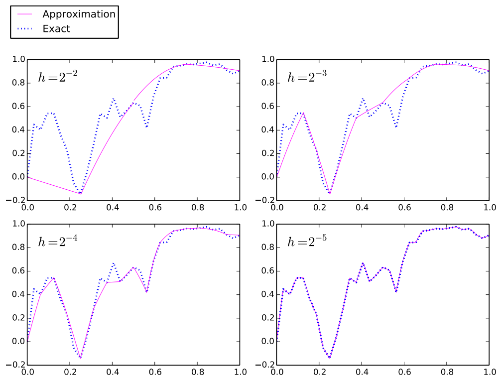

# sdgmethod
Java implementation of the Stochastic Discontinuous Galerkin Method for approximating the solution to ordinary stochastic differential equations.

This method was first described by Mahboub Baccouch and myself in the following paper:

http://dl.acm.org/citation.cfm?id=2979199

A stochastic differential equation (SDE) is a differential equation which contains at least one stochastic term. Physical systems traditionally modeled by deterministic differential equations can be more accurately described by including random effects. SDE models play a significant role in various branches of applied sciences, including economics, finance, biology, chemistry, epidemiology, mechanics, and microelectronics.

Closed form solutions to SDEs often do not exist, and are typically complicated when they do. The inclusion of stochastic terms makes traditional analysis of differential equations more complex by introducing the presence of stochastic calculus and probability theory. In most cases, computer-driven numerical methods must be used to find approximate solutions.

The Stochastic Discontinuous Galerkin Method differs from traditional numerical approximations by fitting piecewise polynomial approximations on each mesh partition. The method has been shown to be highly convergent to the exact solution as we decrease partition size and increase the degree of the the polynomials.

